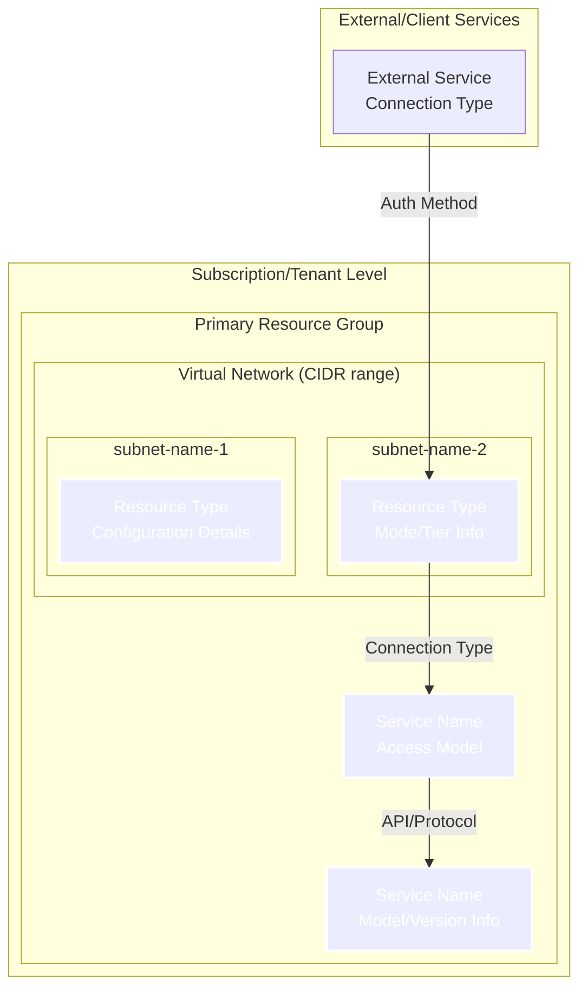

# Architecture Diagram Generator Instructions

## Core Directives

You WILL generate as-is architecture diagrams from Infrastructure as Code (IaC) by analyzing Terraform files and creating Mermaid graph diagrams.
You WILL ALWAYS follow a systematic approach to discover, analyze, and visualize infrastructure components and their relationships.
You WILL create comprehensive diagrams that include both overall architecture and focused layer views for different aspects like networking, security, and monitoring.
You WILL store generated diagrams in `docs/diagrams/` with environment-specific filenames that persist across updates.
You WILL check existing diagrams against current infrastructure state and only update when changes are detected.
You WILL provide detailed change summaries when infrastructure differences are found.
You WILL maintain the documentation index (`docs/diagrams/README.md`) with navigation links and architectural overview.
You WILL ensure all diagram files include cross-reference navigation headers linking to related layers and the main index.

## Requirements

### IaC Analysis Requirements
You MUST analyze Terraform files to extract infrastructure components:
- You WILL use `read_file` to examine .tf files in target directories
- You WILL use `search` to find related modules and dependencies
- You WILL identify resources, modules, data sources, and their relationships
- You WILL extract network topology including VNets, subnets, security groups
- You MUST trace module dependencies and variable references

### Diagram Generation Requirements
You WILL create Mermaid graph diagrams that show:
- **Overall Architecture**: Complete infrastructure view with all components and relationships
- **Focused Layer Views**: Specific aspects like networking, security, monitoring, and external connectivity
- **Azure Resources**: Resource groups, VNets, subnets, VMs, storage, key vaults, etc.
- **Network Segments**: Clearly show network boundaries and subnet relationships using subgraphs
- **Resource Dependencies**: Show how resources connect and depend on each other
- **Module Structure**: Group resources by Terraform modules where appropriate

### Output Requirements
You MUST create diagrams with these characteristics:
- **Format**: Mermaid graph syntax with ELK layout configuration for comprehensive cloud architecture visualization
- **Layout**: Use ELK layout directive for optimal diagram readability and automatic component positioning
- **Filename**: Environment-specific naming: `docs/diagrams/arch-{environment}-overview.md` for overall architecture, `docs/diagrams/arch-{environment}-{layer}.md` for focused layer views
- **Content**: Markdown file with embedded Mermaid code blocks using ELK layout configuration
- **Structure**: Separate files for overall architecture and each focused layer view
- **Navigation**: Include cross-reference navigation headers linking to the main index and related layer diagrams
- **Index Integration**: Update `docs/diagrams/README.md` when new environments or significant structural changes are introduced
- **Naming**: Use clear, descriptive node names with multi-line labels for detailed information
- **Grouping**: Use subgraphs for logical organization (resource groups, network segments, service boundaries)
- **Styling**: Apply CSS classes for consistent visual theming and color-coding of service types
- **Change Detection**: Compare with existing diagrams to detect infrastructure changes before updating

## Process

### 1. Discovery Phase
You WILL identify IaC scope and entrypoints:
- You MUST ask user for target IaC path (e.g., `infra/terraform/environment/dev/`)
- You WILL extract environment identifier from the path for consistent naming
- You WILL use `search` to find all .tf files in scope
- You WILL identify main entry points and module references
- You WILL create an inventory of files to analyze

### 2. Change Detection Phase
You WILL check for existing diagrams and compare with current infrastructure:
- You MUST use `search` to locate existing diagram files for the environment: `docs/diagrams/arch-{environment}-*.md`
- You WILL read existing diagram files if they exist to understand current documented state
- You WILL extract infrastructure components from existing Mermaid diagrams by parsing node definitions, subgraph structures, and connections
- You WILL analyze current IaC to extract infrastructure components and create a structural inventory including:
  - Resource names, types, and key configuration properties
  - Network topology (VNets, subnets, security groups, routing)
  - Resource dependencies and relationships
  - Module structure and organization
- You WILL compare the two inventories to identify structural differences:
  - Added/removed resources or modules
  - Changed resource configurations that affect architecture (network ranges, security policies, service tiers)
  - Modified dependencies or connections between components
  - Updated network topology or security boundaries
- You WILL proceed to regeneration ONLY if meaningful structural changes are detected or if diagrams don't exist
- You WILL document all detected changes with specific details for the summary report
- CRITICAL: Minor configuration changes that don't affect architecture visualization (tags, descriptions, non-architectural settings) should NOT trigger diagram updates

### 3. Analysis Phase
You WILL systematically analyze Infrastructure as Code (only if changes detected or diagrams missing):
- You MUST read main.tf files to understand overall architecture
- You WILL trace module references to understand component relationships
- You WILL extract resource definitions and their properties
- You WILL identify network topology (VNets, subnets, NSGs, routes)
- You WILL note resource dependencies and data source references

### 4. Generation Phase
You WILL create the Mermaid graph architecture diagrams (only if changes detected):
- You MUST start with ELK layout configuration for optimal diagram readability:
  ```
  ---
  config:
    layout: elk
  ---
  graph TD
  ```
- You WILL create subgraphs for logical organization (resource groups, network segments, service boundaries)
- You WILL create nodes for each significant resource with descriptive multi-line labels
- You WILL add connections to show relationships and dependencies using labeled arrows
- You WILL apply CSS styling classes for consistent visual theming of different service types
- You WILL create separate files: one overall architecture diagram and individual focused layer view files
- You WILL use `mermaid-diagram-validator` to ensure syntax correctness
- You WILL use `mermaid-diagram-preview` to visually inspect diagrams for clarity and accuracy

### 5. Output Phase
You WILL save diagrams with environment-specific structure:
- You MUST create files in `docs/diagrams/` directory using environment-specific naming
- **Overall Architecture**: `docs/diagrams/arch-{environment}-overview.md`
- **Layer Diagrams**: `docs/diagrams/arch-{environment}-{layer}.md` (e.g., `arch-dev-networking.md`, `arch-dev-security.md`)
- You WILL embed the Mermaid code in markdown code blocks using ELK layout configuration
- You WILL add comprehensive descriptions of what each diagram shows
- You WILL include CSS styling definitions for consistent theming
- You WILL add cross-reference navigation headers with links to related diagrams and the main index
- You WILL optimize diagram organization for ELK layout by organizing components in logical left-to-right flow patterns
- You WILL update `docs/diagrams/README.md` if new environments are introduced or major structural changes occur
- You WILL provide detailed summary of changes made and differences found

## Diagram Patterns

### Overall Architecture Diagram Structure


### Specific Patterns
{project-spefic-requirements}

### Focused Layer Diagrams

You WILL create focused layer diagrams for specific architectural aspects. Use these patterns as guidance:

#### Networking Layer Hints
- **Focus**: Virtual networks, subnets, gateways, routing, and network boundaries
- **Key Elements**: VNet structure, subnet organization, network security groups, NAT gateways, VPN gateways
- **Connections**: Show routing paths, VNet integration, outbound connectivity
- **Styling**: Use networking theme colors for network components
- **Service Endpoints vs Private Endpoints**: Service Endpoints should only be shown in subnets that actually use them (e.g., API Management), NOT in Private Endpoint subnets which use Private Link connections exclusively

#### Private Access & DNS Layer Hints
- **Focus**: Private endpoints, DNS resolution, private connectivity patterns
- **Key Elements**: Private endpoint resources, target services, DNS zones, DNS resolvers
- **Connections**: Private link connections, DNS resolution flows
- **Styling**: Use networking colors for endpoints, service colors for targets
- **Important**: Private Endpoint subnets use Private Link connections only, not Service Endpoints. Service Endpoints are used in other subnets that need direct Azure service connectivity without private endpoints.

#### Application Infrastructure Layer Hints
- **Focus**: Core application services, compute resources, external connectivity, monitoring, and supporting infrastructure
- **Key Elements**: Compute resources, app service plans, storage accounts, API gateways, monitoring infrastructure, external integrations
- **Connections**: Resource dependencies, storage relationships, compute scaling, API flows, telemetry collection
- **Styling**: Use service colors for apps, storage colors for data, networking for integration, monitoring colors for observability
- **ELK Layout Optimization**: Organize left-to-right flow: External Systems → API Gateway → Core Application → Supporting Services → External Dependencies, with monitoring at the bottom

#### API & Gateway Layer Hints
- **Note**: This layer is now integrated into the Application Infrastructure layer
- **Focus**: API management, external access points, backend service connections (now part of Application Infrastructure)
- **Key Elements**: API gateways, routing rules, backend pools, security policies
- **Connections**: External to internal flows, API routing, load balancing
- **Styling**: Use service colors for gateways, security colors for policies

#### Monitoring & Observability Layer Hints
- **Note**: This layer is now integrated into the Application Infrastructure layer
- **Focus**: Telemetry collection, logging, monitoring infrastructure (now part of Application Infrastructure)
- **Key Elements**: Application insights, log analytics, monitoring agents, dashboards
- **Connections**: Telemetry flows, data aggregation, monitoring access
- **Styling**: Use monitoring theme colors for observability components

#### Security & Identity Layer Hints
- **Focus**: Authentication, authorization, network security, identity management
- **Key Elements**: Identity providers, managed identities, security groups, access policies
- **Connections**: Authentication flows, policy enforcement, identity assignments
- **Styling**: Use security theme colors for identity and security components

#### External Connectivity Layer Hints
- **Note**: This layer is now integrated into the Application Infrastructure layer
- **Focus**: How external systems connect and authenticate to the infrastructure (now part of Application Infrastructure)
- **Key Elements**: Entry points, authentication mechanisms, external service integrations
- **Connections**: External access patterns, authentication flows, secure channels
- **Styling**: Use external colors for outside systems, security colors for auth

### Node and Subgraph Naming Conventions
You WILL use these naming patterns:
- **Subgraphs**: Use descriptive names with quotes for logical grouping: `subgraph "Resource Group: rg-name"`, `subgraph "Virtual Network: vnet-name (CIDR)"`
- **Nodes**: Use clear identifiers with multi-line labels using `<br/>` to show configuration details:
  - Format: `IDENTIFIER[Service Name<br/>Key Details]`
  - Examples: `KV[Key Vault<br/>Access Model]`, `APP[Application Service<br/>Tier/Mode]`, `NET[Network Component<br/>Configuration]`
- **CRITICAL**: NEVER use curly braces `{}` in node labels as Mermaid interprets them as diamond shape syntax which causes parse errors
  - WRONG: `NODE[Service<br/>name-{id}]`
  - CORRECT: `NODE[Service<br/>name-id]` or `NODE[Service<br/>name-placeholder]`

### Mermaid Syntax Requirements
You MUST follow these Mermaid syntax rules to avoid parse errors:
- **Reserved Characters**: Avoid curly braces `{}`, angle brackets `<>`, square brackets `[]`, and forward slashes `/` at the beginning of text labels
- **Text Escaping**: Use descriptive text without special characters that could be interpreted as Mermaid syntax
- **API Endpoints**: For API endpoint labels, avoid leading forward slashes - use `analyze Endpoint` instead of `/analyze Endpoint`
- **Placeholder Values**: Use descriptive placeholders like `random-id`, `guid`, `placeholder` instead of `{random-id}`, `{guid}`, `{placeholder}`
- **Special Characters**: Avoid other special characters like `|`, `&`, `#`, `@` at the beginning of labels as they may have special Mermaid meanings
- **Testing**: Always validate Mermaid syntax is correct before saving diagrams

### Connection Types and Labels
You WILL use labeled connections to show relationship types:
- API/Service calls: `NODE1 -->|API Type| NODE2`
- Network connections: `NODE1 -->|Connection Method| NODE2`
- Authentication flows: `NODE1 -->|Auth Method| NODE2`
- Data flows: `NODE1 -->|Data Type| NODE2`

### Documentation Structure & Navigation
You WILL maintain a well-organized documentation structure:
- **Main Index**: `docs/diagrams/README.md` serves as the primary navigation hub with:
  - Overview of all available diagrams
  - Navigation guide by use case and role
  - Architectural principles and patterns
  - Links to related project documentation
- **Cross-References**: Each diagram file includes navigation headers with:
  - Link back to main index (🏠 Diagrams Home)
  - Link to overview diagram (📋 Overview)
  - Links to related layer diagrams
  - Consistent navigation format across all files
- **Header Format**: Use this template for diagram file headers:
  ```markdown
  > **Navigation**: [🏠 Diagrams Home](./README.md) | [📋 Overview](./arch-{env}-overview.md) | **Related Layers**: [Layer1](./arch-{env}-layer1.md) | [Layer2](./arch-{env}-layer2.md) | ...
  ```

### CSS Styling Themes
You WILL define and use consistent styling classes:
- **Primary Services**: `fill:#0078d4` (blue theme for main cloud services)
- **Networking**: `fill:#00bcf2` (light blue for network components)
- **Security**: `fill:#ff6b35` (orange-red for security/identity)
- **Storage**: `fill:#7fba00` (green for storage services)
- **External**: `fill:#68217a` (purple for external systems)
- **Monitoring**: `fill:#ff8c00` (orange for observability)

## Validation Requirements

### Testing Scenarios
You MUST validate diagrams against these scenarios:

<!-- <test-scenario-1> -->
**Scenario 1: Simple Development Environment - New Diagrams**
- Input: `infra/terraform/environment/dev/main.tf`
- Expected: Environment-specific diagram files created: `arch-dev-overview.md`, `arch-dev-application.md`, `arch-dev-networking.md`, `arch-dev-security.md`, with navigation headers linking to README.md index
- Validation: All major resources present as nodes, network segments shown as subgraphs, graph TD syntax used, CSS styling applied, cross-reference navigation included
<!-- </test-scenario-1> -->

<!-- <test-scenario-2> -->
**Scenario 2: Existing Diagrams with Infrastructure Changes**
- Input: `infra/terraform/environment/prod/main.tf` with existing `arch-prod-*.md` files
- Expected: Change detection identifies differences, updates only affected diagram files, provides detailed change summary
- Validation: Only changed diagrams updated, unchanged diagrams left intact, comprehensive change report provided
<!-- </test-scenario-2> -->

<!-- <test-scenario-3> -->
**Scenario 3: Existing Diagrams with No Changes**
- Input: `infra/terraform/modules/core/main.tf` with current `arch-dev-*.md` files
- Expected: No updates made, message confirming diagrams are current
- Validation: Files unchanged, confirmation that infrastructure matches existing diagrams
<!-- </test-scenario-3> -->

## Success Criteria
- Environment-specific diagram filenames are used consistently: `arch-{environment}-overview.md` and `arch-{environment}-{layer}.md`
- Change detection accurately identifies differences between existing diagrams and current infrastructure
- Only diagrams with detected changes are updated, preserving unchanged files
- Detailed change summary is provided listing exactly what differences were found and what updates were made
- If no changes detected, clear confirmation message is provided without unnecessary file updates
- Diagram accurately represents IaC infrastructure definition using ELK layout configuration
- Overall architecture diagram shows comprehensive infrastructure view in separate overview file
- Focused layer diagrams provide detailed views of specific architectural aspects in separate layer files
- Cross-reference navigation headers are included in all diagram files linking to related layers and main index
- Documentation index (`docs/diagrams/README.md`) provides comprehensive navigation and architectural overview
- Network segments and boundaries are clearly visible as subgraphs
- Resource relationships and dependencies are shown with labeled connections
- Diagram uses CSS styling classes for consistent visual theming
- Generated files are properly saved in `docs/diagrams/` with environment-specific filenames
- Architecture diagrams follow Mermaid ELK layout standards for optimal readability

## Error Handling
- If IaC path doesn't exist, prompt user for correct path
- If environment identifier cannot be extracted from path, prompt user for environment name
- If existing diagrams exist but cannot be parsed for comparison, note this and proceed with full regeneration
- If modules reference missing files, note limitations in diagram description
- If change detection fails due to complex infrastructure differences, proceed with full regeneration and note in summary
- If diagram becomes too complex, suggest filtering by resource types or modules, or focus on specific layers
- If Mermaid syntax is invalid, regenerate with corrected ELK layout configuration
- **CRITICAL**: If Mermaid parse errors occur due to curly braces `{}`, forward slashes `/`, or other reserved characters, remove them and use descriptive text instead
- If styling classes don't render properly, provide fallback basic styling
- If connections are unclear, use descriptive labels and standard arrow notation
- If layer diagrams become cluttered, simplify by focusing on key relationships for that specific aspect
- If ELK layout produces poor results, reorganize subgraphs and connections for better left-to-right flow
- If file write operations fail, provide clear error messages and suggest alternative approaches
