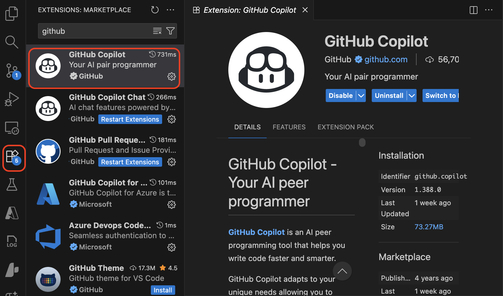

## Step 1: Set Up GitHub Copilot

### Overview
Welcome to the GitHub Copilot hands‑on workshop. In this first step you will install and enable GitHub Copilot (and optionally Copilot Chat) in Visual Studio Code, then verify it works with an inline suggestion. Target time: 10 minutes.

### Prerequisites
Make sure you have:

- **GitHub account** (logged in in your browser; trial or subscription recommended – free plan has limits)
- **Visual Studio Code** (v1.78+)
- **Internet connection**
- **Basic VS Code familiarity** (open files, use sidebar)

### Quick Flow
1. Open VS Code
2. Install GitHub Copilot extension (+ Chat if desired)
3. Sign in & authorize
4. Ensure Copilot is enabled
5. Trigger and accept an inline suggestion
6. Learn accept / reject / cycle actions
7. (Optional) Open Chat
8. Troubleshoot if needed

---

## Detailed Setup Steps

### 1. Open Visual Studio Code
Launch VS Code. A Welcome page or empty window is fine. 

### 2. Install the GitHub Copilot Extension
GitHub Copilot ships as a standard VS Code extension.

2-1. Open the Extensions view (icon with four squares)  
   - Shortcut: `Ctrl+Shift+X` (Windows/Linux) or `Cmd+Shift+X` (macOS) 

2-2. Search: `GitHub Copilot`  

2-3. Locate the official extension (publisher: GitHub) and click **Install**



2-4. (Optional) Also install **GitHub Copilot Chat** if prompted (adds chat panel & commands)  

2-5. Wait until the status bar shows the Copilot icon (a spinning or idle indicator) 

### 3. Set up Copilot in VS Code

To use Copilot in VS Code, you need access to a GitHub Copilot subscription. You can set up Copilot directly from within VS Code.

> If you don't have a Copilot subscription yet, you'll be signed up for the [Copilot Free plan](https://docs.github.com/en/copilot/managing-copilot/managing-copilot-as-an-individual-subscriber/managing-copilot-free/about-github-copilot-free).

3-1. Hover over the Copilot icon in the Status Bar and select **Set up Copilot**.


3-2. Choose a sign-in method and follow the prompts.


3-3. You can now start using Copilot in VS Code. 

### 4. Enable Copilot (Confirm Settings)
Usually enabled automatically, but verify:

1. Open Settings (`Ctrl+,` / `Cmd+,`) and search for "Copilot"
2. Ensure **Enable GitHub Copilot** is checked
3. If you installed Chat, confirm chat settings are enabled (default)

### 5. Verify Inline Suggestions Work
1. Create a new file (`Ctrl+N` / `Cmd+N`) and set language to **Python** (e.g. save as `test.py`)
2. Start typing the following:

```python
# Function to multiply two numbers
def multiply(x, y):
	"""Return the product of two numbers."""
	# Copilot will likely suggest: return x * y
```

3. When ghost text (gray) appears (e.g. `return x * y`), press **Tab** to accept
4. If nothing appears:
   - Type a bit more (e.g. add a comment like `# multiply and return result`)
   - Press `Ctrl+Enter` / `Cmd+Enter` to request a suggestion
   - Confirm you are signed in and the file is small & supported
   - Reload VS Code if still stuck

If you successfully accepted a suggestion – great! 🎉

### 6. Basic Inline Usage
How to interact with suggestions:

- **Accept**: `Tab` (preferred) or `Enter` (single line)
- **Reject / dismiss**: keep typing OR press `Esc`
- **Next suggestion**: `Alt+]` (Windows/Linux) / `Option+]` (macOS)
- **Previous suggestion**: `Alt+[` / `Option+[`
- **Trigger manually**: `Ctrl+Enter` / `Cmd+Enter`
- **Explain / refine**: Use Copilot Chat (see next step)

Always read the ghost text before accepting to ensure it matches intent.


### Troubleshooting
Common issues & fixes:

| Issue | What to Check | Fix |
|-------|----------------|-----|
| No suggestions appear | Not signed in | Run `Copilot: Sign in to GitHub` |
| Gray text flashes then disappears | You kept typing fast | Pause or manually trigger (`Ctrl/Cmd+Enter`) |
| Suggestion irrelevant | Context too small | Add a descriptive comment above code |
| Chat unavailable | Chat extension missing | Install **GitHub Copilot Chat** |
| Rate / usage limits | Free plan restrictions | Start trial or upgrade subscription |

If problems persist: reload window (`Developer: Reload Window`), check network/proxy, or sign out & back in.

---

### Summary
You've successfully set up GitHub Copilot in VS Code, signed in, and verified that inline suggestions work. You're now ready to use Copilot to assist with your coding tasks.

### Next
Proceed to [Step 2: Using GitHub Copilot Chat](./step-2-simple-chat-usage.md) to learn about chat features, slash commands, and Agent mode.


